<!-- README.md is generated from README.Rmd. Please edit that file -->

# clusterfuck

<!-- badges: start -->

<!-- badges: end -->

Make clustering data sets easy with `'clusterfuck'`! Use it to
categorize data into clusters, choose representative data points and
broad structures in the data.

A main feature of this package is the clustering of **non numeric** or
**mixed** data and clustering using exotic **custom distance
functions**.

The implemented clustering algorithms:

- K-Means
- K-Medoids
- spectral clustering
- hierarchical clustering
- DBSCAN
- OPTICS

Additionally it includes

- functions for **generating** Data to test clustering functions on
- a collection of pre made **data for clustering**
- a collection of pre made **distance functions** for clustering (some
  very exotic)
- functions to **view data** and **view clustered data** of up to 3
  Dimensions
- a function to calculate the **silhouette coefficient** of a clustering

## Installation

You can install the development version of clusterfuck from
[GitHub](https://github.com/) with:

``` r
# install.packages("pak")
pak::pak("adamfuge2/R-Projekt-Haufenbildung")
```

## Examples

Lets load clusterfuck

``` r
library(clusterfuck)
```

### Clustering some points in 2D

Lets take a look at a data set

``` r
euclidean_cluster_data |> viewData()
```

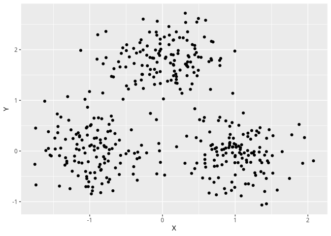

(euclidean_cluster_data is one of the premade data sets and viewData a
function to view it)

We would like to cluster this data set into three distinct parts. We can
use K-Means to do that.

``` r
kMeans(euclidean_cluster_data, K=3)
#> A clustering object:
#> Data clustered by K-Means algorithm 
#> 
#> 
#> $clustered_data
#> A clustered_data object:
#> a tibble with a column called 'cluster'
#> A clustered_data object:
#> a tibble with a column called 'cluster'
#> # A tibble: 400 × 3
#>       X_1     X_2 cluster
#>  *  <dbl>   <dbl>   <int>
#>  1  1.88   0.525        1
#>  2 -1.11   0.217        2
#>  3 -0.166  1.61         3
#>  4 -1.32  -0.238        2
#>  5 -0.340 -0.0216       2
#>  6  1.05   0.0975       1
#>  7  0.493  1.59         3
#>  8 -1.40   0.670        2
#>  9 -0.176  1.51         3
#> 10 -0.495  1.29         3
#> # ℹ 390 more rows
```

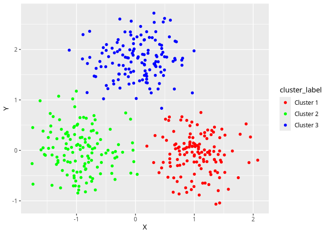

    #> 
    #> $clustering_function
    #> function (x) 
    #> base::which.min(apply(best_centroids, 1, function(centroid) distance(x, 
    #>     centroid)))
    #> <bytecode: 0x55ead1dd91d0>
    #> <environment: 0x55ead1dd81d8>
    #> 
    #> $centroids
    #> # A tibble: 3 × 2
    #>       X_1      X_2
    #>     <dbl>    <dbl>
    #> 1  1.04   -0.0770 
    #> 2 -0.932   0.00742
    #> 3  0.0377  1.81   
    #> 
    #> $inner_inequality
    #> [1] 199.4433
    #> 
    #> $sum_of_squares
    #> [1] 125.8806
    #> 
    #> $mean_silhouette
    #> [1] 0.6870172

The result is a clustering object with some more useful information. See
the vignette of kMeans for more information about it.

### Clustering exotic data sets and distances

An exotic example data set featured in `'clusterfuck'` is

``` r
study_courses_data
#> # A tibble: 19 × 1
#>    study_courses    
#>    <chr>            
#>  1 architecture     
#>  2 biology          
#>  3 chemistry        
#>  4 computer science 
#>  5 economics        
#>  6 egyptoligy       
#>  7 english          
#>  8 geography        
#>  9 geology          
#> 10 greek history    
#> 11 law              
#> 12 mathematics      
#> 13 medical studies  
#> 14 music            
#> 15 philosophy       
#> 16 physics          
#> 17 special education
#> 18 theater education
#> 19 translation
```

with its (made up) distance function `'study_courses_distance'`. Because
is a main feature of the package it is very easy to cluster this pair of
data and distance function.

``` r
hierarchicalClustering(study_courses_data, 
                       custom_distance_function = study_courses_distance)
#> A clustering object:
#> Data clustered by hierarchical clustering algorithm 
#> 
#> 
#> $clustered_data
#> A clustered_data object:
#> a tibble with a column called 'cluster'
#> # A tibble: 19 × 2
#>    study_courses     cluster
#>  * <chr>               <dbl>
#>  1 architecture            1
#>  2 biology                 2
#>  3 chemistry               3
#>  4 computer science        1
#>  5 economics               5
#>  6 egyptoligy              1
#>  7 english                 7
#>  8 geography               1
#>  9 geology                 1
#> 10 greek history           1
#> 11 law                     5
#> 12 mathematics             1
#> 13 medical studies         2
#> 14 music                   1
#> 15 philosophy              1
#> 16 physics                 1
#> 17 special education      17
#> 18 theater education       1
#> 19 translation             7
```

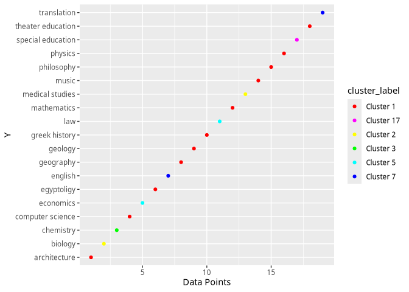

    #> 
    #> $cluster_amount
    #> [1] 6
    #> 
    #> $clustering_function
    #> function (data_point) 
    #> {
    #>     distances <- sapply(1:n, function(i) distance(data_point, 
    #>         data[i, ]))
    #>     D_points_new <- cbind(D_points, distances)
    #>     D_points_new <- rbind(D_points_new, c(distances, Inf))
    #>     cluster_new <- c(saved_cluster[, cluster_amount], n + 1)
    #>     linkage_distances <- sapply(unique(saved_cluster[, cluster_amount]), 
    #>         function(x) mode(n + 1, x, cluster_new, D_points_new))
    #>     unique(saved_cluster[, cluster_amount])[which.min(linkage_distances)]
    #> }
    #> <bytecode: 0x55ead1946eb0>
    #> <environment: 0x55ead194c538>

### Clustering misshapen data without custom distance

K-Means and K-Medoids work very well when the clusters are
**spherical** meaning in a filled ‘round’ ball around a center.

Lets look at this data set.

``` r
two_concentric_circles |> viewData()
```

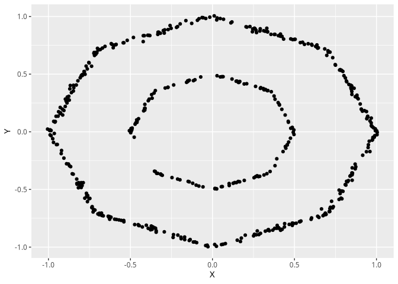

K-Medoids and K-Means have a very hard time clustering this

``` r
kMedoids(two_concentric_circles,K=2)
```

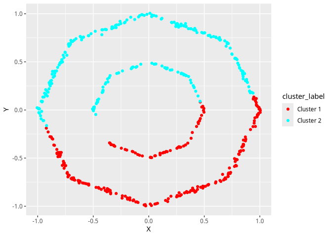

We could now invest the effort and try to define a distance function on
this data to improve the clustering made by K-Medoids and K-Means
(usually one would choose K-Medoids for these kinds of distance
functions).

But far simpler is the approach to use DBSCAN or OPTICS:

``` r
clustering <- optics(two_concentric_circles,epsilon = 0.3,min_Pts = 5)
```

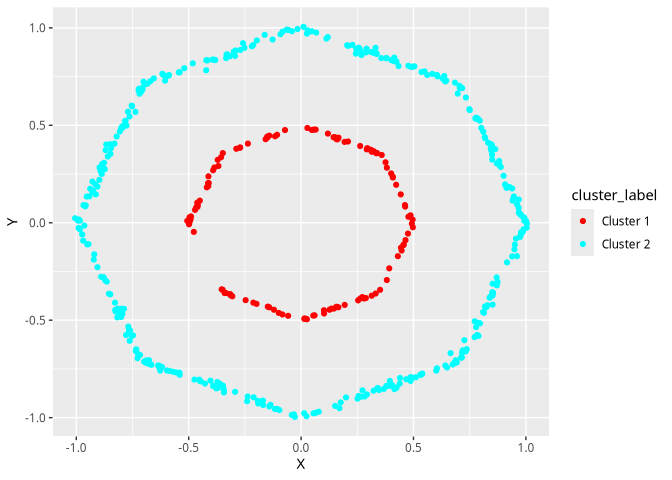

### Clustering is hard

Now lets look at a data set that’s famously hard to cluster:

``` r
three_connected_concentric_circles |> viewData()
```

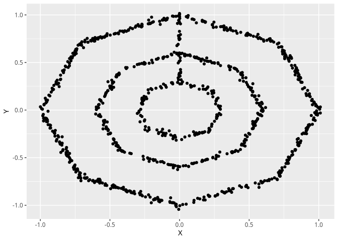

K-Means and K-Medoids fail because the data is non spherical

``` r
kMeans(three_connected_concentric_circles, K=3)
```

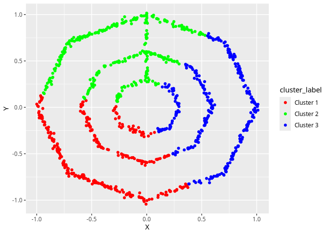

DBSCAN, OPTICS and hierarchical clustering fail because the data points
are all connected

``` r
dbscan(three_connected_concentric_circles,epsilon = 0.1,min_Pts = 5)
#> A clustering object:
#> Data clustered by DBSCAN algorithm 
#> 
#> 
#> $clustered_data
#> A clustered_data object:
#> a tibble with a column called 'cluster'
#> # A tibble: 1,000 × 3
#>          X      Y cluster
#>  *   <dbl>  <dbl>   <dbl>
#>  1  0.525   0.192       1
#>  2 -0.0338 -0.267       1
#>  3  0.723  -0.693       1
#>  4  0.627   0.733       1
#>  5  0.0189  0.597       1
#>  6 -0.790   0.542       1
#>  7  0.381  -0.826       1
#>  8 -0.615   0.733       1
#>  9 -0.0696 -0.962       1
#> 10 -0.132  -0.947       1
#> # ℹ 990 more rows
```

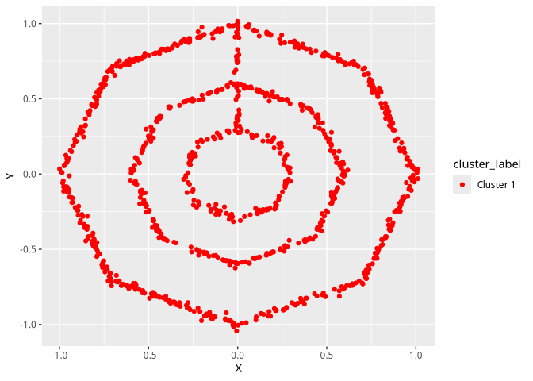

    #> 
    #> $clustering_function
    #> function (point) 
    #> {
    #>     point_df <- as.data.frame(as.list(point))
    #>     colnames(point_df) <- colnames(data)
    #>     dists <- dissimilarityMatrix(rbind(point_df, data), distance_method = distance_method, 
    #>         p = p, custom_distance_function = custom_distance_function)[1, 
    #>         -1]
    #>     neighbors <- which(dists <= epsilon)
    #>     if (length(neighbors) < min_Pts) {
    #>         return(0L)
    #>     }
    #>     neighbor_clusters <- cluster_labels[neighbors]
    #>     neighbor_clusters <- neighbor_clusters[neighbor_clusters != 
    #>         0]
    #>     if (length(neighbor_clusters) == 0) {
    #>         return(0)
    #>     }
    #>     return(neighbor_clusters[[1]])
    #> }
    #> <bytecode: 0x55ead731bbe0>
    #> <environment: 0x55ead7320278>

Our last resort: the powerful spectral clustering:

``` r
spectralClustering(three_connected_concentric_circles,
                   k = 3,
                   gamma = 50,
                   cluster_algorithm = 'K-Medoids',
                   K = 3)
```

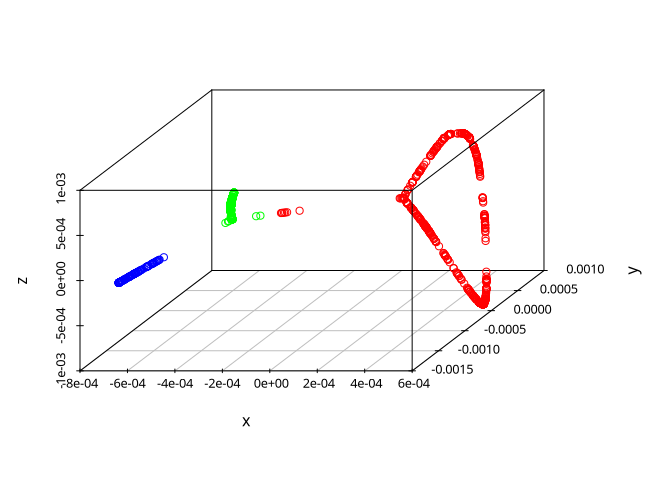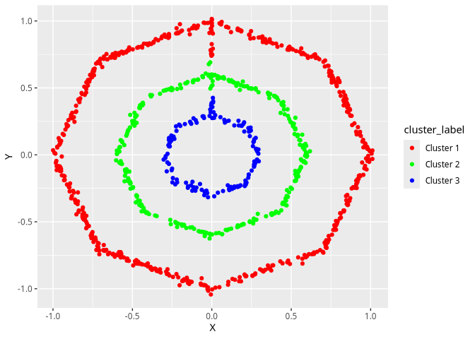

    #> A clustering object:
    #> Data clustered by K-Medoids algorithm 
    #> 
    #> 
    #> $clustered_data
    #> # A tibble: 1,000 × 3
    #>          X      Y cluster
    #>      <dbl>  <dbl>   <int>
    #>  1  0.525   0.192       2
    #>  2 -0.0338 -0.267       3
    #>  3  0.723  -0.693       1
    #>  4  0.627   0.733       1
    #>  5  0.0189  0.597       2
    #>  6 -0.790   0.542       1
    #>  7  0.381  -0.826       1
    #>  8 -0.615   0.733       1
    #>  9 -0.0696 -0.962       1
    #> 10 -0.132  -0.947       1
    #> # ℹ 990 more rows
    #> 
    #> $clustering_function
    #> function (x) 
    #> base::which.min(sapply(1:K, function(k) distance(x, base::unlist(data[old_medoid_indeces[k], 
    #>     ]))))
    #> <bytecode: 0x55ead447a7a8>
    #> <environment: 0x55ead8274df8>
    #> 
    #> $medoids
    #> # A tibble: 3 × 3
    #>         X_1         X_2        X_3
    #>       <dbl>       <dbl>      <dbl>
    #> 1  0.000311  0.00000101 -0.0000232
    #> 2 -0.000610  0.000522   -0.0000393
    #> 3 -0.000638 -0.00129    -0.0000485
    #> 
    #> $inner_inequality
    #> [1] 0.4417552
    #> 
    #> $sum_of_squares
    #> [1] 0.0003111062
    #> 
    #> $mean_silhouette
    #> [1] 0.5692944
    #> 
    #> $projected_clustered_data
    #> A clustered_data object:
    #> a tibble with a column called 'cluster'
    #> # A tibble: 1,000 × 4
    #>          X_1          X_2        X_3 cluster
    #>  *     <dbl>        <dbl>      <dbl>   <int>
    #>  1 -0.000592  0.000418    -0.0000299       2
    #>  2 -0.000652 -0.00143     -0.0000550       3
    #>  3  0.000546 -0.000000835  0.000629        1
    #>  4  0.000369  0.00000131   0.000805        1
    #>  5 -0.000492  0.00000268   0.0000104       2
    #>  6  0.000343  0.000000630 -0.000144        1
    #>  7  0.000571 -0.00000179   0.0000668       1
    #>  8  0.000322  0.000000897 -0.0000636       1
    #>  9  0.000581 -0.00000274  -0.000679        1
    #> 10  0.000580 -0.00000281  -0.000750        1
    #> # ℹ 990 more rows
    #> A clustering object:
    #> Data clustered by K-Medoids algorithm 
    #> 
    #> 
    #> $clustered_data
    #> # A tibble: 1,000 × 3
    #>          X      Y cluster
    #>      <dbl>  <dbl>   <int>
    #>  1  0.525   0.192       2
    #>  2 -0.0338 -0.267       3
    #>  3  0.723  -0.693       1
    #>  4  0.627   0.733       1
    #>  5  0.0189  0.597       2
    #>  6 -0.790   0.542       1
    #>  7  0.381  -0.826       1
    #>  8 -0.615   0.733       1
    #>  9 -0.0696 -0.962       1
    #> 10 -0.132  -0.947       1
    #> # ℹ 990 more rows
    #> 
    #> $clustering_function
    #> function (x) 
    #> base::which.min(sapply(1:K, function(k) distance(x, base::unlist(data[old_medoid_indeces[k], 
    #>     ]))))
    #> <bytecode: 0x55ead447a7a8>
    #> <environment: 0x55ead8274df8>
    #> 
    #> $medoids
    #> # A tibble: 3 × 3
    #>         X_1         X_2        X_3
    #>       <dbl>       <dbl>      <dbl>
    #> 1  0.000311  0.00000101 -0.0000232
    #> 2 -0.000610  0.000522   -0.0000393
    #> 3 -0.000638 -0.00129    -0.0000485
    #> 
    #> $inner_inequality
    #> [1] 0.4417552
    #> 
    #> $sum_of_squares
    #> [1] 0.0003111062
    #> 
    #> $mean_silhouette
    #> [1] 0.5692944
    #> 
    #> $projected_clustered_data
    #> A clustered_data object:
    #> a tibble with a column called 'cluster'
    #> # A tibble: 1,000 × 4
    #>          X_1          X_2        X_3 cluster
    #>  *     <dbl>        <dbl>      <dbl>   <int>
    #>  1 -0.000592  0.000418    -0.0000299       2
    #>  2 -0.000652 -0.00143     -0.0000550       3
    #>  3  0.000546 -0.000000835  0.000629        1
    #>  4  0.000369  0.00000131   0.000805        1
    #>  5 -0.000492  0.00000268   0.0000104       2
    #>  6  0.000343  0.000000630 -0.000144        1
    #>  7  0.000571 -0.00000179   0.0000668       1
    #>  8  0.000322  0.000000897 -0.0000636       1
    #>  9  0.000581 -0.00000274  -0.000679        1
    #> 10  0.000580 -0.00000281  -0.000750        1
    #> # ℹ 990 more rows

**Success!**
